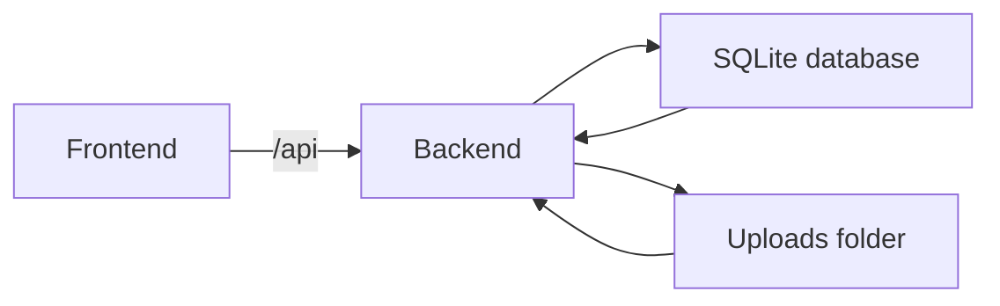
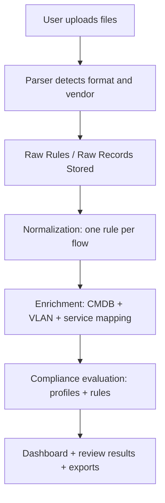
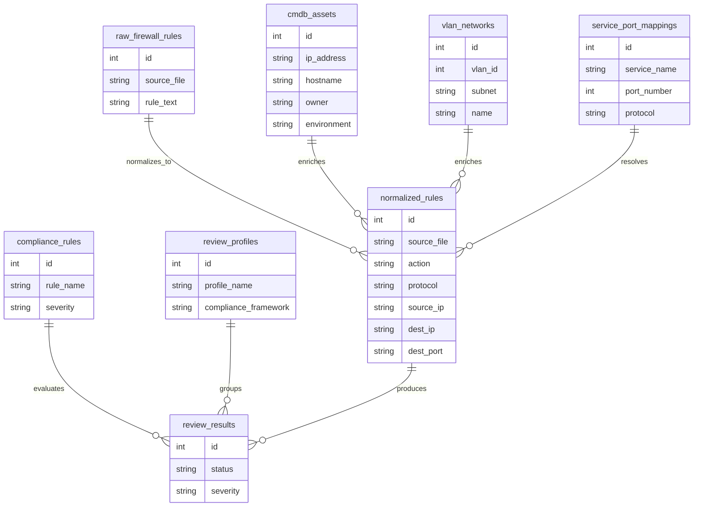
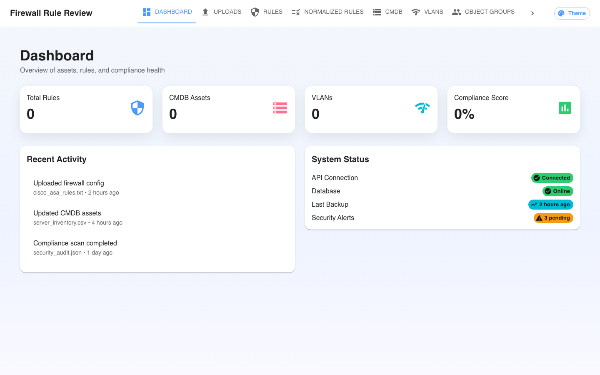
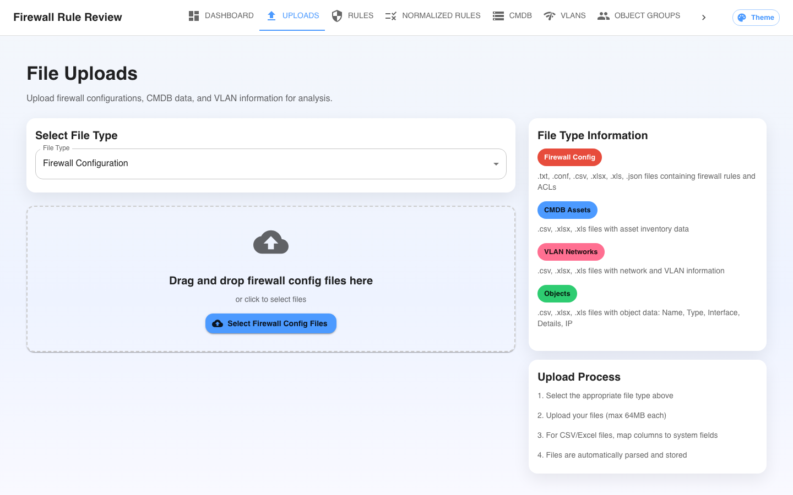
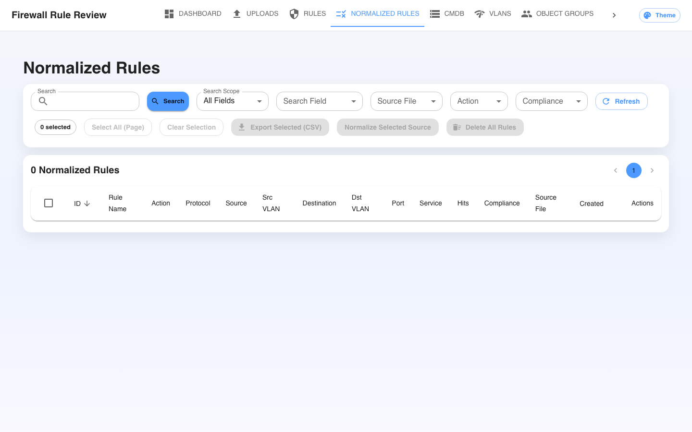
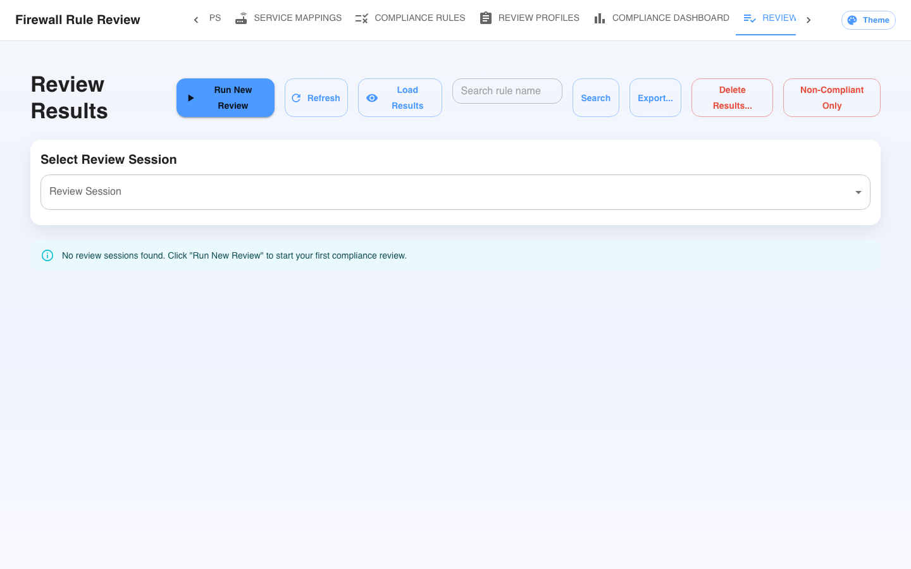

# Firewall Rule Review Application

A comprehensive web application for reviewing, analyzing, and managing firewall rules with CMDB integration and compliance reporting.


## Quick Start (Docker)

```bash
git clone https://github.com/ShanjulMittal/FRR.git
cd FRR
docker compose up -d --build
```

Open:
- UI: `http://localhost:8080/`
- API: `http://localhost:5001/`
- Health: `http://localhost:5001/health`

## Table of Contents

- [Features](#-features)
- [Architecture](#️-architecture)
- [Prerequisites](#-prerequisites)
- [Installation & Setup](#️-installation--setup)
- [Running the Application](#-running-the-application)
- [Usage Examples](#-usage-examples)
- [Development](#-development)
- [Troubleshooting](#-troubleshooting)

## 🚀 Features

- **Firewall Rule Management**: Parse and analyze firewall configurations from various formats
- **CMDB Integration**: Manage and correlate network assets with firewall rules
- **VLAN Network Mapping**: Track and visualize VLAN configurations
- **Compliance Reporting**: Generate compliance reports and identify security gaps
- **Interactive Dashboard**: Real-time statistics and system monitoring
- **File Upload Support**: Support for multiple file formats (CSV, Excel, JSON, text configurations)

## 🏗️ Architecture

### Technology Stack

- **Backend**: Python Flask with SQLAlchemy ORM
- **Database**: SQLite (default) via SQLAlchemy
- **Frontend**: React with TypeScript and Material-UI
- **Data Processing**: Pandas for data manipulation and parsing

### Architecture Diagram



### Data Flow (Typical Ingestion)



### Data Model (At a Glance)



### Project Structure

```
FRR/
├── backend/
│   ├── app.py              # Main Flask application
│   ├── models.py           # Database models
│   ├── parsers/            # File parsing utilities
│   ├── requirements.txt    # Python dependencies
│   ├── .env.example        # Environment configuration template
├── frontend/
│   ├── src/
│   │   ├── components/     # Reusable React components
│   │   ├── pages/          # Application pages
│   │   ├── services/       # API service layer
│   │   └── App.tsx         # Main React application
│   ├── package.json        # Node.js dependencies
│   └── .env.example        # Frontend environment template
└── README.md
```

## 📋 Prerequisites

- Docker Desktop (Windows/macOS) or Docker Engine (Linux)
- Docker Compose V2
- (Local dev only) Python 3.11+ and Node.js 18+

## 🛠️ Installation & Setup

### 1. Clone the Repository

```bash
git clone https://github.com/ShanjulMittal/FRR.git
cd FRR
```

### 2. Backend Setup

#### Create Python Virtual Environment

```bash
cd backend
python -m venv venv

# Activate virtual environment
# On macOS/Linux:
source venv/bin/activate
# On Windows:
venv\Scripts\activate
```

#### Install Python Dependencies

```bash
pip install -r requirements.txt
```

#### Configure Environment Variables

```bash
cp .env.example .env
```

Edit the `.env` file with your configuration:

```env
DATABASE_URL=sqlite:///firewall_review.db
SECRET_KEY=your-secret-key-here
FLASK_ENV=development
FLASK_DEBUG=True
```

#### Database

The application uses SQLite by default and will automatically create tables on first run.

### 3. Frontend Setup

#### Install Node.js Dependencies

```bash
cd ../frontend
npm install
```

#### Configure Environment Variables

```bash
cp .env.example .env
```

Edit the `.env` file:

```env
REACT_APP_API_URL=http://localhost:5001
```

## 🚀 Running the Application

### Docker (Recommended)

This is the easiest way to run FRR on any OS (Windows/macOS/Linux) and CPU (x86_64/amd64, arm64).

```bash
docker compose up -d --build
```

Open:
- UI: `http://localhost:8080/`
- API: `http://localhost:5001/`
- Health: `http://localhost:5001/health`

Common commands:

```bash
docker compose ps
docker compose logs -f backend
docker compose logs -f frontend
docker compose restart
docker compose down
```

Notes:
- Docker UI runs on port `8080` (Nginx). Port `3000` is only for the local React dev server.
- The backend uses SQLite by default and persists the DB in the Docker volume (`frr-backend-data`).
- Uploads are stored under `/data/uploads` in Docker (or `backend/uploads` when running locally).

### Multi-Arch Images (Publish to Docker Hub / GHCR)

The included Dockerfiles use multi-arch base images, so you can build and publish both `linux/amd64` and `linux/arm64` images.

Example (Docker Hub):

```bash
docker buildx create --use
docker buildx build --platform linux/amd64,linux/arm64 -t <dockerhub_user>/frr-backend:latest ./backend --push
docker buildx build --platform linux/amd64,linux/arm64 -t <dockerhub_user>/frr-frontend:latest ./frontend --push
```

### Start the Backend Server

```bash
cd backend
source venv/bin/activate  # Activate virtual environment
python app.py
```

The Flask API will be available at `http://localhost:5001`

### Start the Frontend Development Server

```bash
cd frontend
npm start
```

The React application will be available at `http://localhost:3000`

## 📊 Database Schema

### Core Tables

- **raw_firewall_rules**: Stores parsed firewall rules with metadata
- **cmdb_assets**: Network asset inventory with ownership information
- **vlan_networks**: VLAN configuration and subnet information
- **object_groups**: Named object groups for rule organization
- **object_group_members**: Members of object groups (IPs, subnets, nested groups)

## 🔧 API Endpoints

### Health & Status
- `GET /health` - API health check
- `GET /api/dashboard/stats` - Dashboard statistics

### Data Management
- `GET /api/rules` - Retrieve firewall rules
- `GET /api/cmdb` - Retrieve CMDB assets
- `GET /api/vlans` - Retrieve VLAN networks
- `GET /api/object-groups` - Retrieve object groups

### File Operations
- `POST /api/upload` - Upload and process configuration files

## 📁 Supported File Formats

### Firewall Configurations
- Cisco ASA configurations (.txt, .conf)
- Palo Alto configurations
- Generic ACL text files

### CMDB Data
- CSV files with asset information
- Excel spreadsheets (.xlsx, .xls)
- JSON formatted asset data

### VLAN Information
- CSV files with VLAN mappings
- Excel spreadsheets with network data
- JSON formatted VLAN configurations

## 🎯 Usage Examples

### Uploading Firewall Rules

1. Navigate to the "Uploads" page
2. Select "Firewall Configuration" as file type
3. Drag and drop or select your configuration file
4. The system will parse and store the rules automatically
5. For Cisco ASA uploads, go to "Normalized Rules", select the uploaded Source File, then click "Normalize Selected Source" (re-normalize whenever you re-upload the same file)

### Viewing Dashboard

The dashboard provides:
- Total counts of rules, assets, and VLANs
- Compliance score overview
- Recent activity log
- System status indicators

### Managing CMDB Assets

1. Upload CMDB data via the Uploads page
2. View and search assets in the CMDB section
3. Filter by environment, asset type, or owner

### UI Pages (What You’ll See + How to Use)

| Page | Primary Data | What to Do Here | Tips |
| --- | --- | --- | --- |
| Dashboard | Rollups and status indicators | Confirm data exists after uploads and normalization | Use this as a quick sanity check before deeper review |
| Uploads | File ingestion (Firewall / CMDB / VLAN) | Upload files and map columns when prompted | Upload CMDB + VLAN before compliance for richer context |
| Rules | Raw parsed rule lines | Spot parsing issues (missing fields, unexpected actions/services) | If raw parsing looks wrong, fix the source file or parser before normalizing |
| Normalized Rules | Normalized “one rule = one flow” | Filter by Source File; normalize/re-normalize; export; bulk cleanup | For Cisco ASA: normalize after upload; re-normalize whenever you re-upload the same file |
| CMDB | Assets (IP/hostname/owner/environment/category) | Validate asset coverage and enrich rule context | Missing CMDB entries reduce compliance/business-context accuracy |
| VLANs | VLAN-to-subnet mapping | Populate VLAN context for source/destination | Helps segment environments and improves future topology mapping |
| Object Groups | Groups + members discovered/imported | Scan/import groups; inspect membership; delete stale groups | Useful for ASA object-group-heavy configs |
| Service Mappings | Port↔service name catalog | Import IANA mappings; edit service labels | Better mappings improve service visibility in normalized rules |
| Compliance Rules | Atomic checks (operators, logic, severity) | Review/adjust rule definitions and severities | Keep rules small and composable; use profiles to group them |
| Review Profiles | Sets of compliance rules | Build templates (e.g., PCI baseline) | Use profiles to standardize reviews across teams/files |
| Compliance Dashboard | Compliance metrics and charts | Track compliance posture and trends | Strongly depends on normalized + enriched data |
| Review Results | Findings per review run | Drill down into failing rules and evidence | Use export + filters to share results with stakeholders |
| Custom Fields | Field definitions extracted/stored | Extend what metadata is captured and evaluated | Useful for rule naming, ownership, change references, etc. |

### Application Screenshots

Screenshots:

| Dashboard | Uploads |
| --- | --- |
|  |  |
| Normalized Rules | Review Results |
|  |  |

## 🔍 Development

### Roadmap (Upcoming Features)

- Graphical connectivity view of rules (source → destination) showing servers, services, and allowed flows
- VLAN-aware environment segmentation (e.g., prod/non-prod) to generate a richer network map
- Network topology builder to model architecture and place multiple firewalls in the path
- Single-pane “network stack” view that combines topology + firewall rules + service mappings + CMDB context

### Adding New Parsers

1. Create a new parser class in `backend/parsers/`
2. Implement the required parsing methods
3. Update the upload endpoint to handle the new format

### Extending the API

1. Add new routes in `backend/app.py`
2. Create corresponding service methods in `frontend/src/services/api.ts`
3. Update the frontend components to use the new endpoints

## 🐛 Troubleshooting

### Common Issues

1. **Database Connection Error**
   - Check DATABASE_URL in `.env` (SQLite is the default)
   - For Docker, confirm the backend container is healthy and the volume `frr-backend-data` is created
   - If you configured an external database, ensure it is reachable from the backend

2. **CORS Issues**
   - Verify REACT_APP_API_URL in frontend .env
   - Check that Flask-CORS is properly configured

3. **File Upload Failures**
   - Check file size limits (16MB max)
   - Verify upload directory permissions
   - Ensure file format is supported

### Logs and Debugging

- Backend logs: Check Flask console output
- Frontend logs: Open browser developer tools
- Database errors: Check backend logs for SQL/connection errors

## 🤝 Contributing

1. Fork the repository
2. Create a feature branch
3. Make your changes
4. Add tests if applicable
5. Submit a pull request

## 📄 License

This project is licensed under the MIT License - see the LICENSE file for details.

## 🆘 Support

For support and questions:
- Create an issue in the repository
- Check the troubleshooting section above
- Review the API documentation

---

**Phase 1 Complete**: Foundation & Technology Stack ✅

This implementation provides a solid foundation for the Firewall Rule Review Application with all core components in place and ready for Phase 2 development.
